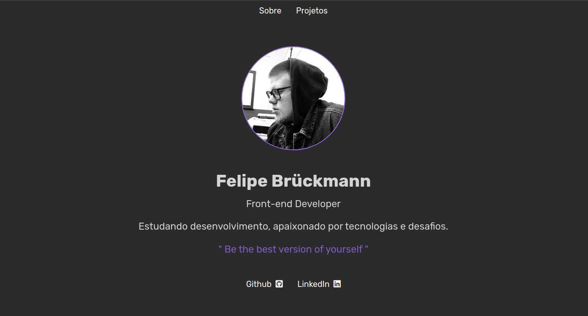
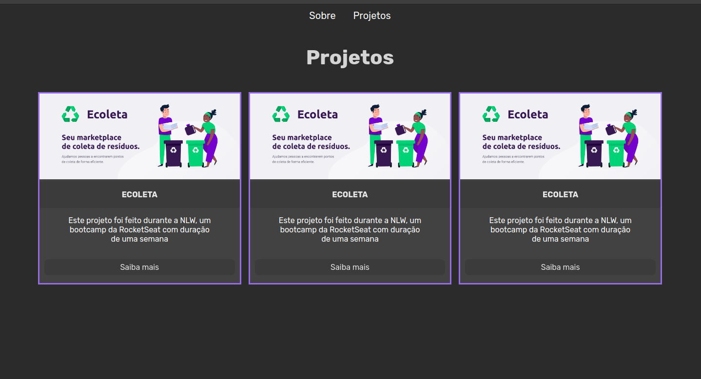
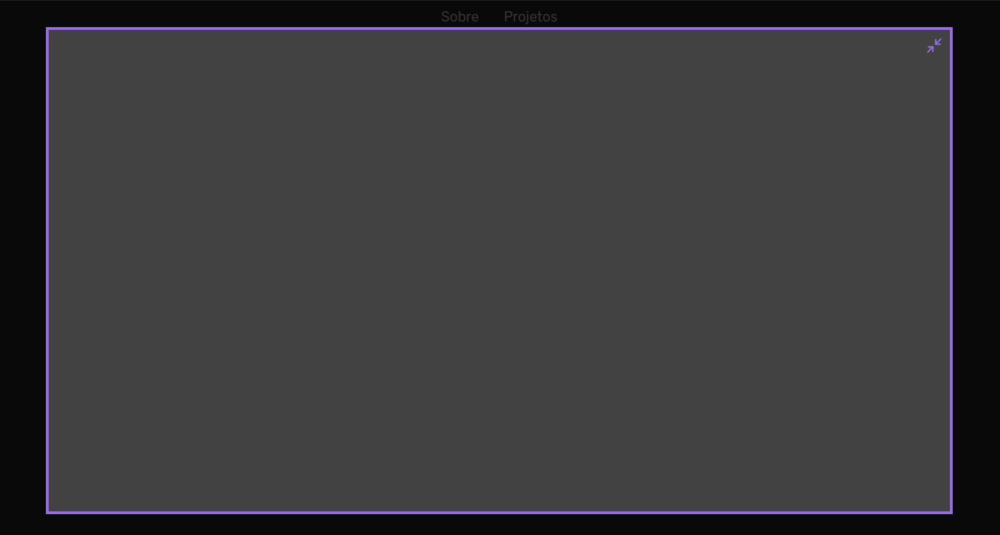

<h1 align="center">Basic layout for a personal page</h1>
 

This is a simple layout design for a personal use page, created in baselaunch bootcamp by Rocketseat, using only 

<ul>
    <li>HTML;</li>
    <li>CSS;</li>
    <li>JavaScript.</li>
</ul>

I didn’t put anything on the modal page because now it doesn’t make much sense, but in the future i will update this page

 
<h2>Some images below</h2>
 
<h2 align="center">
    
Home

     
     
    
Projects page

     
     
    
Modal page (empty for now)

</h2>
 
<h2 align="center">
    